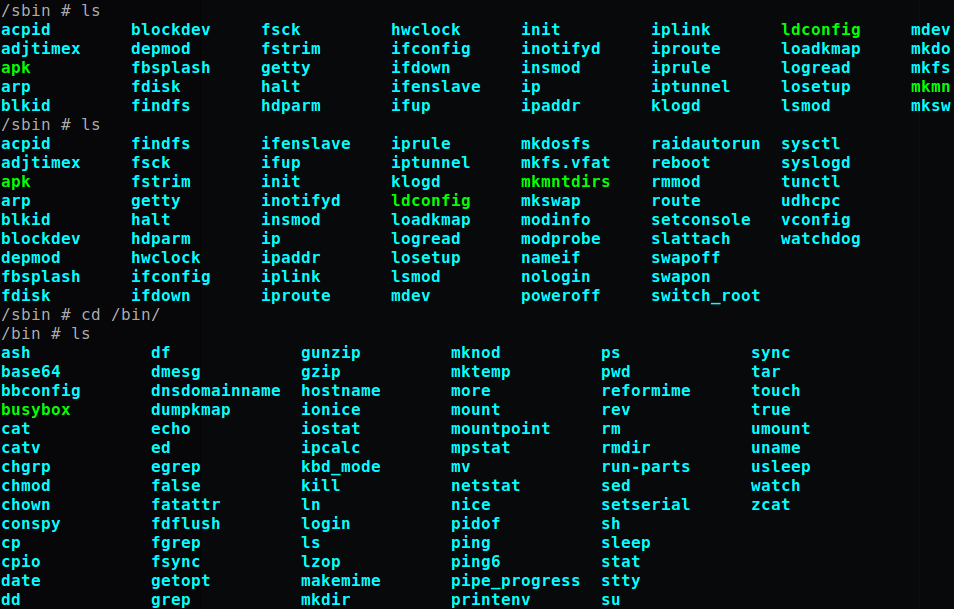

# 在Docker中搭建以太坊私有链
1. 制作Dockerfile，构建Ethereum镜像

  Docker Hub上也有Ethereum-go镜像，这里打算自定义Ethereum-go镜像，官方镜像有两种，一种是基于Ubuntu的，另一种是基于Alpine Linux（一种轻量级的Linux发行版，包管理工具为apk，它的内置命令如图1）的，而这里也打算基于Alpine构建Ethereum-go镜像，因为Alpine镜像比较小，下载比较快.那为什么不用官方的呢，因为构建官方基于Alpine的Ethereum-go镜像的Dockerfile中有命令：`ENTRYPOINT [/geth]`，所以每次启动容器时还需要为其传入参数，想要进入shell界面，还需要在启动容器时使用参数`--entrypoint /bin/sh`(注意这里的参数是`docker run`的参数，而非geth(go实现的Ethereum客户端)的参数),比较麻烦，因而在自定义的Dockerfile中去掉了那条命令.

  

  Dockerfile：

  ```
  FROM alpine:3.5
  RUN \
  apk add --update go git make gcc musl-dev linux-headers ca-certificates && \
  git clone --depth 1 https://github.com/ethereum/go-ethereum && \
  (cd go-ethereum && make geth) && \
  cp go-ethereum/build/bin/geth /geth && \
  apk del go git make gcc musl-dev linux-headers && \
  rm -rf /go-ethereum && rm -rf /var/cache/apk/*
  EXPOSE 8545
  EXPOSE 30303
  ```
  制作好Dockerfile后，在其所在的文件夹下运行`sudo docker build -t xuxiao415/privatechain:1.0 .`，这里`xuxiao415/privatechain`为镜像名称(`xuxiao415`为Docker Hub用户名，只有这样，`sudo docker push xuxiao415/privatechain:1.0`命令才能将构建的镜像推送上传到自己的Docker Hub上),`1.0`为标签或版本号.

  这样就构建了基于Alpine的Ethereum-go镜像.

2. 搭建以太坊私有链

  根据构建的镜像，启动多个容器，就可以得到多个以太坊节点，将这些节点连接起来就构成了一个以太坊私有链.

  * 启动容器
  ```
  sudo docker --name node1 -p 10001:30303 -p 10002:8545 -it xuxiao415/privatechain:1.0 /bin/sh
  ```
  这里还可以制定卷volume，使用参数`-v 主机文件夹绝对路径:容器文件夹绝对路径`.这里需要启动多个节点，这里启动两个节点.第二容器启动命令：
  ```
  sudo docker --name node2 -p 10003:30303 -p 10004:8545 -it xuxiao415/privatechain:1.0 /bin/sh
  ```
  * 启动geth客户端

  在各个容器中启动依次如下命令：

  第一个容器：
  ```
  /geth --identity node1 --datadir /chaindata --networkid 7777 --nodiscover --rpccorsdomain "*" --rpc --rpcport "8545" --port "30303" --nat "any" --rpcapi "admin,eth,debug,miner,net,shh,txpool,personal,web3" console
  ```
  第二个容器：
  ```
  /geth --identity node2 --datadir /chaindata --networkid 7777 --nodiscover --rpccorsdomain "*" --rpc --rpcport "8545" --port "30303" --nat "any" --rpcapi "admin,eth,debug,miner,net,shh,txpool,personal,web3" console
  ```
  * 连接各节点

  上个步骤中会进入geth控制台中，在控制台中连接两个节点.运行如下命令：
  ```
  admin.addPeer('enode://id@ip:port')
  ```
  id为对方geth的id，可在对方geth控制台中运行命令`admin.nodeInfo.id`得到;ip可在对方容器shell中运行`hostname -i`得到，或者在主机上运行`sudo docker inspect 容器名或容器id`得到;port默认为30303.

  连接好后，可以运行命令`admin.peers`来查看连接的节点.

  至此，以太坊私有链就搭建好了.
