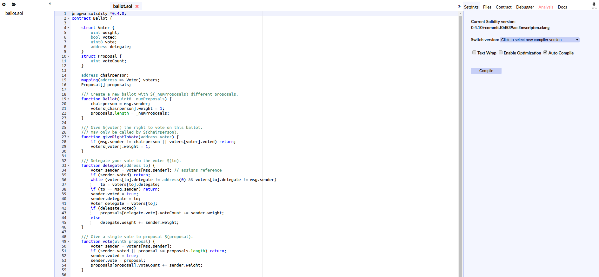
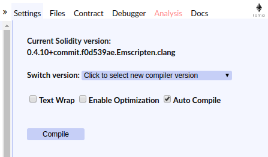
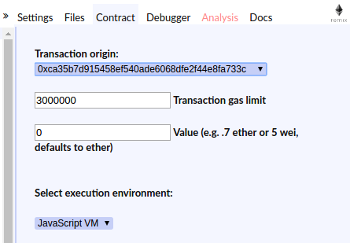
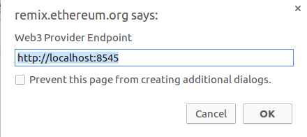

# 基于Docker搭建智能合约开发环境
---
### 在Docker中搭建智能合约开发环境

基于Docker搭建以太坊私有链([搭建私有链链接](https://github.com/xuxiao415/Learning_Notes_of_Ethereum/blob/master/%E5%9C%A8Docker%E4%B8%AD%E6%90%AD%E5%BB%BA%E4%BB%A5%E5%A4%AA%E5%9D%8A%E7%A7%81%E6%9C%89%E9%93%BE.md))，并在每个节点上安装solc编译器.这样每个节点中就可以编译并部署智能合约了(切记，部署智能合约时一定不要忘了挖矿，不然智能合约无法部署到区块链上).这里所用的Ethereum客户端依然是geth.geth本身可以部署智能合约，但却不能编译,因而需要solc来编译智能合约.

在Docker中安装solc编译器.这里依然需要制作Dockerfile来构建Docker镜像.

Dockerfile：

```
FROM xuxiao415/ethereum-go:alpine
MAINTAINER xuxiao415 "xuxiao415@foxmail.com"

RUN \
apk --no-cache --update add build-base cmake boost-dev git && \
sed -i -E -e 's/include <sys\/poll.h>/include <poll.h>/' /usr/include/boost/asio/detail/socket_types.hpp && \
git clone --depth 1 --recursive -b release https://github.com/ethereum/solidity && \
cd /solidity && cmake -DCMAKE_BUILD_TYPE=Release -DTESTS=0 -DSTATIC_LINKING=1 && \
cd /solidity && make solc && install -s solc/solc /usr/bin && \
cd / && rm -rf solidity && \
apk del sed build-base git make cmake gcc g++ musl-dev curl-dev boost-dev && \
rm -rf /var/cache/apk/*
```
这里的`xuxiao415/ethereum-go`镜像的Dockerfile为：
```
FROM alpine:3.5

RUN \
apk add --update go git make gcc musl-dev linux-headers ca-certificates && \
git clone --depth 1 https://github.com/ethereum/go-ethereum && \
(cd go-ethereum && make geth) && \
cp go-ethereum/build/bin/geth /geth && \
apk del go git make gcc musl-dev linux-headers && \
rm -rf /go-ethereum && rm -rf /var/cache/apk/*

EXPOSE 8545
EXPOSE 30303
```
构建镜像时尽量在科学上网的情况下，不然有可能会失败.

构建好镜像后，就可以启动容器，也即以太坊节点，并把各节点连接起来，之后就可以在容器的`shell`界面创建`.solc`或`.sol`文件，并使用solc编译了([solc编译器使用说明](https://github.com/ethereum/solidity/blob/develop/docs/using-the-compiler.rst)，还可以在命令行使用`--help`查看solc的使用方法)，之后就可以在geth控制台部署智能合约了.也可以不创建solc文件编写智能合约，直接在geth控制台中编写智能合约，就是比较麻烦，因为在控制台中智能合约代码不能换行缩进，不易编写智能合约，所以不建议使用，不过官方的第一个智能合约greeter确实在geth控制台中写的，不过现在在控制台中编译solc文件的方法已经在geth-1.6中被删除了，编译时会提示找不到方法.

---

### 在Docker外搭建智能合约开发环境

上一种方法中，智能合约的整个开发过程完全可以在Docker容器中完成，但就是在编写智能合约时，比较麻烦，因为在创建的Docker容器中似乎只有vi编辑器，对新人来说，不太适合，因而这里打算使用智能合约开发的IDE--Remix.Remix是一个Solidity语言的集成开发环境，也就是智能合约的开发环境，它可以集编译、部署智能合约于一身，非常方便.它是在线的IDE，也就是只要有浏览器不用安装就可以直接使用.之前的集成开发环境是Mix，但现在换成了Remix.

这里的Remix是在主机上运行的，因为Docker中没有图形界面，无法安装谷歌等浏览器，只能在主机上使用Remix，然后通过RPC连接Docker中的以太坊私有链节点.

1. 首先启动[Remix](http://remix.ethereum.org)，如下图：

2. 使Remix连接以太坊私有链节点，前提是私有链已经启动，并且启动时使用参数`--rpc --rpcaddr ip`，这里的`ip`是节点所在Docker容器的ip地址，不是`127.0.0.1`，也不是`localhost`，而是它的外网ip地址，在容器中的shell中使用命令`hostname -i`即可得到ip地址，或在主机中使用`sudo docker inpect name`，其中`name`为Docker容器的名字.还有一点就是，在创建容器时要将主机的某个端口与容器进行映射，使用参数`-p host_port:container_port`，一般`container_port`为`8545`，geth的RPC API就是使用的这个端口，这一点格外重要，因为主机上的Remix就是通过RPC API连接的以太坊私有链节点.以上准备工作做好以后就可使用Remix连接节点了，步骤如下：

* 在Remix右上角点击Contract

  
* 找到Select execution environment选项，选择Web3 Provider

  
* 将端口号8545更改为与容器端口8545映射的主机端口`host_port`，点击OK即可连接你的私有链节点了

  

以上就是两种搭建智能合约开发环境的两种方法.
